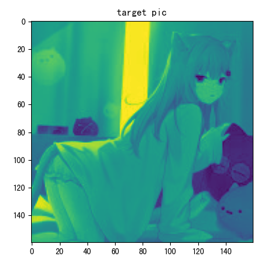
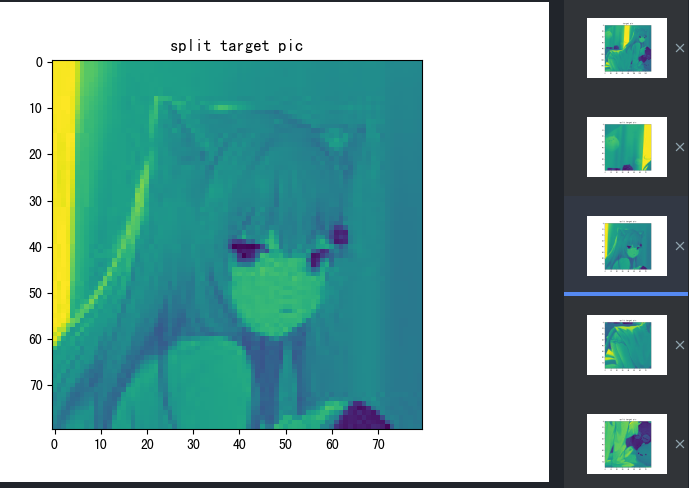
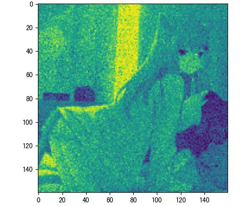

## Some application 4 Genetic Algorithm

### 1. Generate picture

#### Run

```python3 gen_pic.py```

#### Detail

1. split to small picture block

   

   split to small pic:

   

2. use genetic algorithm generate small picture

   Thanks for Ray framework, we can easily parallelize it.

3. combine all small pictures.

   

4. Done.